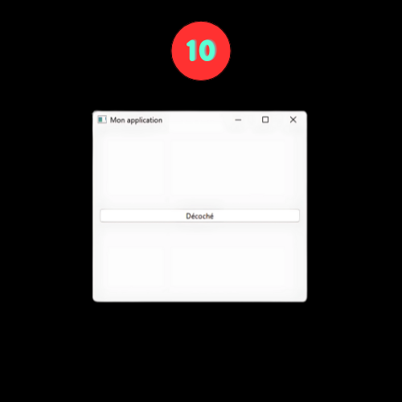

<div align="center">
<br>


</div>


<p align="center">


</p>


<h1 align="center"> PySide6 - Projects </h1>


<h3 align="center">
<a href="https://github.com/RazikaBengana/PySide6_Projects/tree/main#eye-about">About</a> •
<a href="https://github.com/RazikaBengana/PySide6_Projects/tree/main#hammer_and_wrench-tasks">Tasks</a> •
<a href="https://github.com/RazikaBengana/PySide6_Projects/tree/main#memo-learning-objectives">Learning Objectives</a> •
<a href="https://github.com/RazikaBengana/PySide6_Projects/tree/main#computer-requirements">Requirements</a> •
<a href="https://github.com/RazikaBengana/PySide6_Projects/tree/main#keyboard-more-info">More Info</a> •
<a href="https://github.com/RazikaBengana/PySide6_Projects/tree/main#mag_right-resources">Resources</a> •
<a href="https://github.com/RazikaBengana/PySide6_Projects/tree/main#bust_in_silhouette-authors">Authors</a> •
<a href="https://github.com/RazikaBengana/PySide6_Projects/tree/main#octocat-license">License</a>
</h3>

---

<!-- ------------------------------------------------------------------------------------------------- -->

<br>
<br>

## :eye: About

<br>

<div align="center">

**`PySide6 - projects`** is a collection of simple `GUI` applications built using `PySide6`, a set of `Python` bindings for the `Qt` framework.
<br>
<br>
The programs demonstrate various aspects of `GUI` development, from **basic window creation to more complex layouts and interactions**.
<br>
This project serves as a learning resource for those interested in developing desktop applications with `Python` and `PySide6`.

</div>

<br>
<br>

<!-- ------------------------------------------------------------------------------------------------- -->

## :hammer_and_wrench: Tasks

<br>

**`1. Main Window - Button`**

<br>


<br>

**`2. Main Window - Configuration`**

<br>


<br>

**`3. Main Window - Button`**

<br>


<br>

**`4. Main Window - Textbox`**

<br>


<br>

**`5. Main Window - Simple Text Display`**

<br>


<br>

**`6. Main Window - List`**

<br>


<br>

**`7. Main Window - Layout`**

<br>


<br>

**`8. Main Window - Layout`**

<br>


<br>

**`9. Main Window - Button Interaction`**

<br>


<br>

**`10. Main Window - Toggle Button`**

<br>



<br>

**`11. Main Window - Text Edit`**

<br>


<br>

**`12. Main Window - Text Edit`**

<br>


<br>

**`13. Main Window - Button Clicks`**

<br>


<br>

**`14. Main Window - Random Multi-windows`**

<br>


<br>

**`15. Main Window - Random Colored Buttons`**

<br>


<br>

**`16. Main Window - Login UI`**

<br>


<br>

**`17. Main Window - Login UI`**

<br>


<br>

**`18. Main Window - Layout`**

<br>


<br>

**`19. Main Window - Navigation & Title`**

<br>


<br>
<br>

<!-- ------------------------------------------------------------------------------------------------- -->

## :memo: Learning Objectives

<br>

```diff

General

+ Learn how to create basic GUI applications using PySide6

+ Understand how to create and configure main windows

+ Learn about different types of widgets such as buttons, text boxes, and labels

+ Understand how to create and manage layouts

+ Learn how to handle user interactions and events

+ Understand how to create, style and customize widgets

+ Learn about size policies and how to control widget sizes

+ Understand how to create multiple windows in an application

+ Learn about signals and slots in PySide6

```

<br>
<br>

<!-- ------------------------------------------------------------------------------------------------- -->

## :computer: Requirements

<br>

```diff

General

+ Python 3.x

+ PySide6 library

+ Basic understanding of Python programming

+ Familiarity with object-oriented programming concepts

+ A development environment capable of running Python scripts

+ Understanding of basic GUI concepts

+ Ability to read and understand Python and PySide6 documentation

+ Willingness to experiment and learn through practice

```

<br>

**_Why all your files should end with a new line? See [HERE](https://unix.stackexchange.com/questions/18743/whats-the-point-in-adding-a-new-line-to-the-end-of-a-file/18789)_**

<br>
<br>

<!-- ------------------------------------------------------------------------------------------------- -->

## :keyboard: More Info

<br>

This project is a hands-on approach to learning `PySide6`. 

Each script in the project demonstrates a specific concept or feature of `PySide6`. 

It's recommended to run each script, observe the output, and then study the code to understand how the `GUI` is created and how it functions.

<br>
<br>

### Installing `PySide6`:

<br>

#### :white_check_mark: Ensure you have `Python` installed on your system

<br>

- :warning: `PySide6` supports `Python 3.6` and later versions

<br>
<br>

#### :white_check_mark: Create a virtual environment (recommended):

<br>

```yaml
python -m venv pyside6_env
```

<br>

#### :white_check_mark: Activate the virtual environment:

<br>

- On `Linux` or `Mac`:

<br>

```yaml
source pyside6_env/bin/activate
```

<br>

- On `Windows`:

<br>

```yaml
pyside6_env\Scripts\activate
```

<br>
<br>

#### :white_check_mark: Install `PySide6` using `pip`:

<br>

```yaml
pip install PySide6
```

<br>
<br>

#### :white_check_mark: Verify the installation:

<br>

```yaml
python -c "import PySide6; print(PySide6.__version__)"
```

<br>

- This should print the installed version of `PySide6`.

<br>
<br>

#### :white_check_mark: If you encounter any issues, make sure your `pip` is up-to-date:

<br>

```yaml
pip install --upgrade pip
```

<br>

- Then try installing `PySide6` again.

<br>
<br>

#### :white_check_mark: For development, you might also want to install the `PySide6` development tools:

<br>

```yaml
pip install pyside6-tools
```

<br>
<br>

:pushpin: **Reminder**:

<br>

Remember to activate your **virtual environment** each time you work on this project. 

This keeps your `PySide6` installation isolated from other `Python` projects.

<br>
<br>

<!-- ------------------------------------------------------------------------------------------------- -->

## :mag_right: Resources

<br>

**_Do you need some help?_**

<br>

**Read or watch:**

* [PySide6 - Documentation](https://doc.qt.io/qtforpython-6/)

* [Qt for Python - Tutorial](https://doc.qt.io/qtforpython-6/tutorials/index.html)

* [Python GUI Programming With PyQt](https://realpython.com/learning-paths/pyqt-gui-programming/)

* [Layout Management in Qt](https://doc.qt.io/qt-6/layout.html)

* [Signals and Slots in PySide6](https://doc.qt.io/qtforpython-6/PySide6/QtCore/Signal.html)

* [Qt - Style Sheets Reference](https://doc.qt.io/qt-6/stylesheet-reference.html)

<br>
<br>

<!-- ------------------------------------------------------------------------------------------------- -->

## :bust_in_silhouette: Authors

<br>


<br>
<br>

<!-- ------------------------------------------------------------------------------------------------- -->

## :octocat: License

<br>

```PySide6 - projects``` _project has no license specified._

<br>
<br>

---

<p align="center"><br>2024</p>